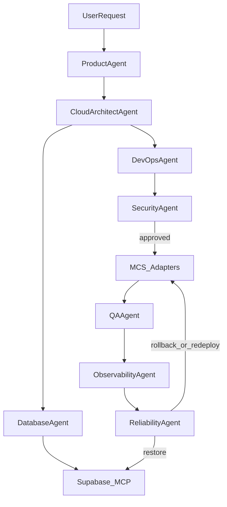

# Agentic Infrastructure Engine

**Status:** Phase 0 architecture  
**Parent roadmap:** [AI Engineering Platform](../roadmap/AI_ENGINEERING_PLATFORM.md)  
**Related:** [Marketplace](./MARKETPLACE.md)

Infrastructure is maintained by specialised AI agents that call **MCS** and **Supabase MCP** tools — never raw vendor SDKs.

---

## 1. Agent roster

### Existing (Phase 1)

| Agent | Responsibility |
|---|---|
| Product | PRD / feature prompts / tags |
| DevOps | IaC + MCS plan/apply façade |
| Security | Approvals, secrets, audit |
| Backend | Service shapes; coordinates dataplane |
| QA | Post-apply readiness |
| Orchestrator | Routes MCP calls across agents |

### New (Phase 6)

| Agent | Responsibility | Primary tools |
|---|---|---|
| **Cloud Architect** | Designs networking, regions, multi-cloud topology | MCS describe + deploy; writes architecture artifacts |
| **Kubernetes** | Clusters, upgrades, HPA, rollouts, Helm | `mcs.kubernetes` |
| **Database** | Schemas, migrations, indexes, backups, query optimisation | Supabase MCP |
| **Security** (expanded) | IAM, vulns, compliance, RLS review | MCS + Supabase `generate_rls` / policies |
| **Observability** | Dashboards, tracing, metrics, alerts | Marketplace Grafana/Prometheus/PostHog + MCS `get_metrics` |
| **Cost Optimisation** | Rightsizing, idle teardown, SKU/region advice | MCS inventory + cost estimators |
| **Reliability** | Uptime, retry failed deploys, DR coordination | MCS rollback/deploy + Supabase backup/restore |

---

## 2. Control loop

---

## 3. Production workflow (full)

1. User request  
2. AI generates PRD  
3. AI generates architecture (Cloud Architect)  
4. Supabase project provisioned (Database Agent)  
5. Database + Auth + Storage + RLS configured  
6. Edge Functions generated as needed  
7. Application scaffolded (Backend + Product)  
8. Kubernetes manifests / Dockerfiles generated when required  
9. Docker images built (`mcs.docker`)  
10. Infrastructure provisioned (MCS adapters)  
11. Application deployed globally  
12. Monitoring configured (Observability)  
13. Agents monitor production continuously (Reliability + Cost + Security)

---

## 4. Package home

- Prompt registry and role metadata → `packages/agents`
- Runtime orchestration → `packages/mcp-server` (Phase 1) → later `apps/api` worker
- Each agent declares: `tools[]`, `approvalPolicy`, `systemPrompt`, `inputSchemas`

---

## 5. Phase 6 exit criteria

- [ ] All new agents registered and invocable from Orchestrator.
- [ ] At least one end-to-end mocked run: PRD → Supabase stubs → MCS deploy → observability config.
- [ ] Cost and Security agents can block apply with structured reasons.
